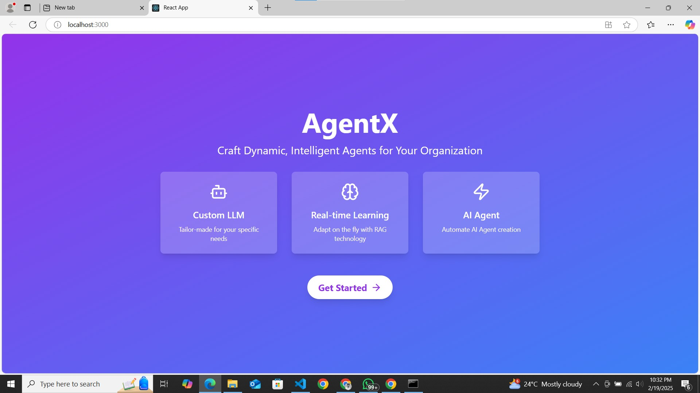

# AgentX

- AgentX is an MLaaS platform that automates the creation of context-specific AI agents, enabling users to build AI-powered solutions effortlessly.
- Integrates Retrieval-Augmented Generation (RAG) to fine-tune LLMs dynamically, ensuring AI agents are optimized for specific tasks and domains.
- Automates AI agent workflows, allowing seamless execution of complex tasks without manual intervention, enhancing productivity and efficiency.
= Deliveres AI agents as a product, providing businesses with ready-to-use, task-oriented AI models that streamline operations and decision-making.
